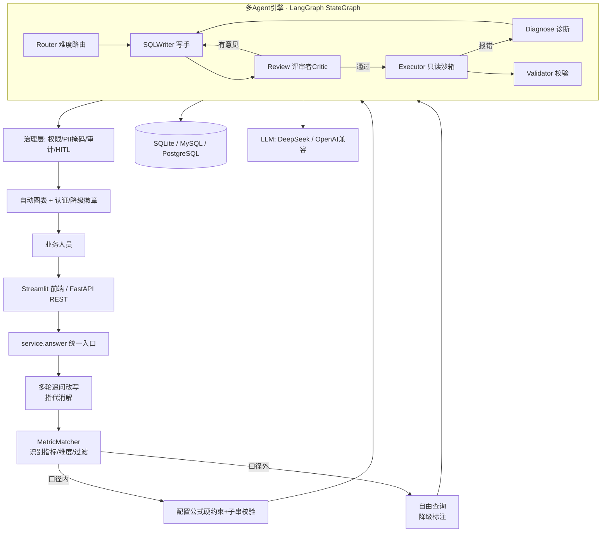

# 多智能体 Text-to-SQL 智能取数产品

面向**业务人员自然语言取数**的多智能体系统 + 业务语义层产品。核心设计原则：**推理归 LLM、计算归代码**——语义理解/生成/评审/诊断交给 LLM，执行/比对/护栏/口径公式交给确定性代码，杜绝大模型算错或篡改业务口径。

三层结构：

- **底层引擎**：基于 **LangGraph StateGraph** 编排的多 Agent 自愈引擎（Supervisor 协调 Router / SQLWriter / Review(Critic) / Diagnose / Validator），附带可复现的 EX/EM 评测框架（**本仓库不附带可信准确率数字**，见下文"评测框架"）。
- **业务语义层**：配置化指标中心（GMV / 客单价 / 取消率（公开数据无退款表，用取消率近似退货率）等公式写在配置里，并附防篡改校验）+ 权限白名单 + PII 掩码 + 审计留痕 + HITL 人工复核 + 用户认证（角色绑定），用 **Olist 真实电商数据**（~10万订单）做业务验证。
- **产品层**：Streamlit 对话式前端（登录/多轮追问/自动图表/查询历史/收藏/反馈）+ FastAPI REST 后端 + MySQL/PostgreSQL 数据源接入 + Docker 一键部署。

> **实现状态（诚实声明）**：运行引擎基于 LangGraph StateGraph（`--engine langgraph`，`langgraph` 已装机可用）；`pipeline.py` 是无依赖的离线回退编排器，两者**并非完全等价**（见下文）。"并行候选生成"当前是顺序的（Writer↔Review 闭环）；Chroma 长时记忆 / Checkpoint 断点续跑未实现；Schema-Linker 已实现为可选的 `--schema-link`。未实现项不在 README 中虚构为已实现。

---

## 核心特性

**一句话概括**：
> 一个"业务员自然语言取数"的多智能体产品，**基于 LangGraph StateGraph 编排**：底层是**分级路由 + 写手↔评审者(Critic)闭环 + 只读沙箱自愈**的 Text-to-SQL 引擎；上层是**配置化指标中心**（公式注入 + 防篡改校验）+ **权限/掩码/审计**；产品层提供**多轮对话取数、自动图表、指标可视化管理、MySQL/PG 接入、REST API、Docker 部署**。附**可复现评测框架**（分层抽样 + EX/EM + 自愈/评审消融），**但本仓库不附带可信的准确率数字**（见"评测框架"一节）。

- **引擎**：多 Agent 自愈（路由→写手→评审→执行→报错修复→校验），推理/计算解耦，沙箱只读、护栏防死循环。
- **语义层**：配置化指标防"口径幻觉"（公式由配置注入并做**子串校验**兜底；该校验可被"保留表达式但改过滤/包装"绕过，属已知局限）+ 表列权限 + PII 掩码 + 审计 + HITL。
- **分级放行**：口径内走配置硬约束（认证徽章）；口径外走多 Agent 自由生成（降级标注）。
- **产品化**：多轮追问（指代消解改写）、结果自动图表、指标中心可视化管理、MySQL/PostgreSQL 方言适配、FastAPI REST API、Docker Compose 一键部署、pytest + GitHub Actions CI。
- **两种模式隔离**：评测(Spider-dev) / 业务(真实 Olist)，业务样例不算 EX。
- **评测框架**：分层抽样 + EX/EM + 自愈深度/评审者/Schema-Linker 三类消融，逐题结果可落盘（准确率需自行重跑，仓库不提供数字）。

---

## 功能总览

| 页面/能力 | 说明 |
|---|---|
| 🔐 登录认证 | 用户名+密码登录，角色绑定（admin/analyst），权限随角色生效 |
| 💼 业务取数 | 对话式取数：口径内→配置公式硬约束（🛡️认证）；口径外→多Agent自由生成（🔓降级标注）；结果自动推荐图表；支持多轮追问；回答下方可 👍/👎 反馈、⭐ 收藏 |
| 📜 查询历史 | 按用户查看历史查询记录（含 SQL、认证状态、结果行数） |
| ⭐ 收藏夹 | 收藏常用查询，可快速回看 SQL |
| ⚙️ 指标中心 | 指标/维度/业务别名的可视化增删改，带校验，保存即时生效 |
| 🗄️ 数据源管理 | SQLite 内置 + MySQL/PostgreSQL 注册、连接测试；密码加密存储；沙箱语句级安全校验全方言一致 |
| 🧪 引擎演示 | Spider 真实基准单题演示 + 实测消融结果展示 + 多Agent编排链路可视化 |
| 🔌 REST API | FastAPI：`/api/query` `/api/metrics` `/api/audit` `/api/datasources` `/health`，Swagger 在 `/docs` |

---

## 目录结构

```
sqlpa/
├── app.py                          # ★ Streamlit 前端（业务取数/指标中心/数据源/引擎演示）
├── api.py                          # ★ FastAPI REST 后端
├── run_eval.py                     # ★ 评测模式：Spider/BIRD 真实基准（默认LangGraph引擎）
├── run_business.py                 # ★ 业务模式 CLI：自然语言取数+口径说明+审计
├── config/settings.yaml            # 阈值/护栏/模式开关（改规则不改代码）
├── .env.example                    # LLM Key / 端点模板
├── Dockerfile / docker-compose.yml # 一键容器化（web:8501 + api:8000）
├── .github/workflows/ci.yml        # GitHub Actions：push/PR 自动跑离线测试（首次 push 后生效）
├── tools/
│   ├── build_olist_db.py           # Olist 真实数据导入 SQLite
│   ├── build_olist_sample.py       # 同结构小样本(离线验证)
│   └── download_data.py            # 下载 Spider/BIRD（需可联网机器）
├── src/sqlpa/
│   ├── graph/langgraph_graph.py    # ★ LangGraph StateGraph 生产版编排
│   ├── graph/pipeline.py           # 确定性等价编排器（离线回退）
│   ├── agents/router.py            # schema 感知难度路由
│   ├── sandbox/sql_executor.py     # 只读加固沙箱（语句级安全校验，全方言一致）
│   ├── sandbox/dialects.py         # MySQL/PostgreSQL 连接器（会话级只读+schema提取）
│   ├── llm/{base,mock_llm,openai_compat}.py  # 可插拔 LLM
│   ├── eval/metrics.py             # EX / EM 度量
│   ├── data/{loader,schema_extractor}.py
│   ├── business/                   # 业务语义层
│   │   ├── business_config.yaml    #   指标/维度/过滤模板/别名（配置化口径）
│   │   ├── metric_config.py        #   加载 + 支持度校验
│   │   ├── metric_matcher.py       #   MetricMatcher：LLM识别+关键词兜底
│   │   ├── metric_guard.py         #   公式硬约束构建 + 篡改校验
│   │   ├── metric_store.py         #   指标中心 CRUD（带校验）
│   │   ├── assembler.py            #   确定性组装器（离线兜底）
│   │   ├── followup.py             #   多轮追问上下文改写
│   │   ├── charting.py             #   结果自动图表推荐
│   │   ├── service.py              #   ★ 统一入口：分级放行（认证/降级）
│   │   ├── datasources.py          #   数据源注册中心（密码加密存储）
│   │   ├── permissions.py          #   表列权限 + PII 掩码
│   │   ├── audit.py / hitl.py      #   审计留痕 / 人工复核队列
│   │   └── storage.py              #   SQLite 持久化（用户/审计/HITL/反馈/收藏）
├── tests/                          # pytest 套件（离线、无需Key、CI可复现）
│   ├── conftest.py                 #   公共 fixture（样本库/迷你库）
│   ├── test_sandbox.py             #   沙箱安全 + 方言适配
│   ├── test_engine.py              #   多Agent编排链路
│   ├── test_product.py             #   分级放行/多轮/图表/指标CRUD/数据源
│   ├── test_api.py                 #   REST API 接口
│   └── manual_*.py                 #   手动脚本（依赖本地Spider数据，不进CI）
├── docs/                           # CaseStudy 与 项目过程问题与解决
└── data/                           # benchmark_results(手动维护的展示常量，非实测证据) / olist(gitignored)
```

## 系统架构



> 关键设计：**推理交给 LLM（识别/生成/评审/诊断），执行/比对/护栏/口径公式交给确定性代码**——杜绝大模型算错或篡改业务口径。

---

## 快速开始

### 方式一：Docker（推荐，一键跑）

```bash
docker compose up          # web: http://localhost:8501  api: http://localhost:8000/docs
```

### 方式二：本地

```bash
pip install -r requirements.txt
cp .env.example .env       # 填 LLM_API_KEY（DeepSeek/OpenAI兼容）；不填则离线模式

# 离线测试（无需 Key、无需外部数据）
pytest tests -q

# Streamlit 前端
streamlit run app.py
# 演示账号：admin / admin123（管理员）  ｜  analyst / analyst123（分析师）

# FastAPI 后端
uvicorn api:app --port 8000

# 评测模式（需 Key + Spider 数据）
py run_eval.py --dataset spider --db-root data/spider --split dev --sample 50

# 业务模式 CLI
python run_business.py --question "各个品类的GMV"
```

### REST API 示例

```bash
curl -X POST http://localhost:8000/api/query \
  -H "Content-Type: application/json" \
  -d '{"question": "各个品类的GMV", "role": "analyst"}'
```

返回含 `mode`(metric/free)、`certified`(是否口径认证)、`sql`、`columns`、`rows`、`agent_trace`（多Agent编排链路）。

---

## 在 PyCharm 里接真实 LLM 跑真实准确率

1. `pip install -r requirements.txt`（含 langgraph / langchain 等）。
2. 复制 `.env.example` 为 `.env`，填 `LLM_API_KEY`（DeepSeek/OpenAI 兼容端点即可）。
3. 用 `tools/download_data.py` 下载 Spider/BIRD（在可联网机器上）。
4. 运行：
   ```bash
   py run_eval.py --dataset spider --db-root data/spider --split dev --ablation --limit 50
   py run_eval.py --dataset bird   --db-root data/bird   --split dev
   ```
5. 结果以 EX / EM / 平均修复轮次 / 延迟 输出；主路径可用 `--out` 指定逐题 JSON 落盘（**消融/基线路径当前不落盘，需要留证时请自行扩展**）。`--ablation` 给出自愈深度 L0/L1/L3 对比。

> **运行引擎**：默认用 **LangGraph StateGraph**（`--engine langgraph`，见 `sqlpa/graph/langgraph_graph.py`，含分支/护栏/自愈/评审闭环/公式约束）。`langgraph` 未安装时回退 `pipeline.py`（无依赖离线实现）；**两者并非完全等价**（提示词构造与评审轮次上限不同），报告中应注明实际使用的引擎。

## 如何获得真实准确率

⚠️ **重要**：`pytest` 离线套件用 **Mock LLM**，只能证明**流程/沙箱/度量正确**，**不代表真实准确率**。要得到真实 EX/EM 与消融增量，需要：

1. **下载真实数据集**（在可联网机器上）：
   ```bash
   py tools/download_data.py --dataset spider --dir data/spider
   py tools/download_data.py --dataset bird   --dir data/bird
   ```
2. **配置 LLM Key**：复制 `.env.example` 为 `.env`，填入 `LLM_API_KEY`。
3. **跑评测**：用 `run_eval.py` 对 dev split 计算 EX/EM 并跑消融（`--ablation` / `--critic-ablation` / `--schema-link-ablation`）。
   - 现有实现提供的是 **zero-shot（`max_repair_round=0`）vs 自愈/评审** 的对照；
   - README 早期版本提到的 "Baseline2：单 Agent + Schema RAG" **并未实现**，不要引用。

## 业务产品模式（把实验变成真实业务产品）

> 为避免"只是一个基准验证实验"，在引擎之上叠加了一层**业务语义层 + 产品层**。两种模式严格隔离：

- 🧪 **评测模式**（`run_eval.py`）：关闭业务层，直接跑 **Spider-dev**，测**引擎本身**的 EX（保证与论文基线可比）。**业务样例绝不参与 EX 计算。**
- 💼 **业务产品模式**（`app.py` / `api.py` / `run_business.py`）：开启业务语义层 + 护栏 + 审计，面向**业务人员自然语言取数**。

### ⚠️ 价值锚点：**这不是"教业务写 SQL"**
这个项目**不是**"把中文翻译成 SQL、帮不会写 SQL 的人写 SQL"（那是 NL-to-SQL 最容易被问倒的伪定位）。真正的价值是 **指标语义层 + 治理 + 长尾自助取数**：

- **核心**：把 GMV / 客单价 / 取消率等**业务口径配置化统一**（公式写在配置、注入后做子串校验），+ **权限白名单 / PII 掩码 / 审计**，让业务不用排队找数分也能拿到**口径一致**的数据。
- **服务的是"长尾 / 临时 / 探索式"取数**：看板报表覆盖**固定、高频**的指标；而"**临时想看某个维度异常、某组合**"这类**长尾**问题看板覆盖不到、找数分又排队长——**这才**是它的用武之地（**不是替代看板**，是补充看板覆盖不到的长尾，且因语义层而口径/权限可控）。
- 解决的问题：**"同一个指标，不同人、不同 SQL 算出不同口径"** 的真实痛点。
- **对标品类**：这是一类真实存在的产品 —— **dbt Semantic Layer / Cube / MetricFlow / Looker / AtScale**（"语义层 + 自助 + 治理"），以及近两年的 **AI-BI / text-to-dashboard 智能体**。**NL 生成 SQL 只是外壳，语义层 + 治理才是核心。**

### 分级放行（产品化的核心策略）

- **口径内**（命中配置指标且组合受支持）→ 权威公式作为**硬约束**喂给 Writer → 引擎生成查询结构 → 校验"公式未被篡改" → 权限 → 只读执行/掩码 → 审计。结果标记 **🛡️ 口径已认证**。
- **口径外**（未命中指标 / 维度组合不受支持）→ 不再生硬拦截，走引擎多 Agent **自由生成**，权限/沙箱/掩码照常生效，结果标记 **🔓 未经口径认证**，由用户自行判断。

### 多轮追问 + 自动图表

- **多轮追问**：有 LLM 时做指代消解/省略补全（question rewriting），无 LLM 时确定性启发式兜底；改写结果透传下游并记入审计。
- **自动图表**：按「列名 + 数据类型 + 行数」确定性推荐——1维度+1数值→柱状图（日期维度→折线）、2维度→分组柱状、单行单数值→指标卡。

### 指标中心（语义层可运营）

指标的公式、来源、支持维度全部配置化。指标中心页面提供可视化增删改（带校验），保存即时生效于业务取数。**防篡改校验是"表达式子串包含"判定**：能拦住"把表达式删掉"，但拦不住"保留表达式同时改过滤条件 / 对表达式做包装"——这是已知局限，不是完备的口径保障。

### 数据源接入（MySQL / PostgreSQL）

- 沙箱的**语句级安全校验**（SELECT-only / 高危关键字拦截）对所有方言一致生效；
- 外部连接器另有**会话级只读双保险**（MySQL `SET TRANSACTION READ ONLY` / PostgreSQL `set_session(readonly)`）；
- schema 通过 information_schema 自动提取（含外键），注入 LLM 上下文时附带方言提示。
- 驱动惰性导入：仅用 SQLite 可不装 pymysql/psycopg2。

**业务数据底座：Olist 真实公开电商数据集（~10万订单）**
```bash
# 你下载 Olist CSV 放到 data/olist/ 后：
python tools/build_olist_db.py --src data/olist --out data/olist/olist.db
```
> 说明：业务层用**真实公开数据**(Olist)；`data/olist_sample/` 是**同结构小样本**，仅用于离线验证组装逻辑（非真实数据）。

## 真实评测结果（Spider-dev · 实测）

> **数据来源**：Spider-dev，跨库分层随机抽样 **N=50（seed=42）**，引擎 `--engine langgraph`，模型 **qwen3.7-flash**（阿里云百炼兼容端点，`LLM_TEMPERATURE=0`）。逐题产物在 `eval_results/`（83 个文件，含每题 SQL / 路由 / 修复轮次 / token / 成本 / `gold_failed`），可复核。
> 复现命令：
> ```bash
> python run_eval.py --dataset spider --split dev --sample 50 --seed 42 --engine langgraph \
>   --baseline --ablation --ablation-rounds 1,3 --out-dir ./eval_results
> ```

### 模型池与可追溯性

`MODEL_POOL` 会按顺序尝试模型，遇 **403/额度耗尽/404/401/400/context超限/空内容** 切换到下一个，仅 **429/5xx/超时** 在当前模型上指数退避重试；全部失败才抛错（并在错误中列出试过的池）。实测确认切换有效：池首 `qwen3.7-flash` 额度耗尽返回 403 后，自动切到 `qwen3.8-max` 并成功生成 SQL。

**但"会切换"必须能被观测**：若产物不记录实际模型，一旦运行中途切换，导出的 EX/token/成本就是多模型混合且无人察觉。因此每题 JSON 现记录 `model` 字段，汇总记录 `models = {模型名: 题数}`，报告会打印实际模型并在出现**多于一个模型**时显式告警。

> 本轮 N=50 的产物生成于该字段加入之前，故无 `model` 记录。事后按 token 分布核验：四个臂的 `prompt_tokens/total_tokens` 占比集中在 **12.6%–13.8%**、token 分布为单峰右偏（反映题目复杂度差异，而非双峰），**与"全程单一模型"一致**，未发现池切换痕迹。

**另修一个真 bug**：`--model` 此前**锁不住模型**——它只设置 `self.model`，而 `_chat` 遍历的是 `model_pool`（来自 `MODEL_POOL`），因此传了 `--model` 仍可能在池里漂移。现在显式传 `--model` 会把池收敛为单一成员，才真正是"可归因到单一模型"的评测：

```bash
# 池化运行（默认）：有故障切换，产物记录每题实际模型
python run_eval.py --dataset spider --split dev --sample 50 --seed 42 --engine langgraph --baseline

# 锁定单一模型：不做切换，绝对指标可归因
python run_eval.py --dataset spider --split dev --sample 50 --seed 42 --engine langgraph \
  --model qwen3.8-max --baseline
```

| 配置 | EX | EM | token/题 | 成本/题 | 平均延迟 | 平均修复轮次 |
|---|---|---|---|---|---|---|
| **L0** 单次直出（zero-shot，无自愈） | **0.82** (41/50) | 0.04 | 2367 | ¥0.00062 | 28.9s | 0.00 |
| **L1** 引擎（最多修 1 轮） | **0.86** (43/50) · **0.88** (44/50) | 0.02 | 2845–2923 | ¥0.00074 | 36–39s | 0.12–0.14 |
| **L3** 全自愈（最多修 3 轮） | **0.90** (45/50) | 0.04 | 4001 | ¥0.00104 | 47.7s | 0.38 |

**结论（含不确定度，不夸大）**：
- **自愈有效**：L0 → L1 提升 **+4 ~ +6 pp**（41 → 43/44 题）；L1 → L3 再 **+2 ~ +4 pp**（44 → 45 题）。
- **代价是 token**：L3 每题 4001 token，是 L0 的 **1.69 倍**（1.41 倍于 L1），延迟从 28.9s 涨到 47.7s。
- **⚠️ 必须说明的运行间波动**：同一份 L1 配置在这次运行中跑了两次（`baseline_engineL1` 与 `ablation_L1`），结果分别为 **43/50 与 44/50**——**差 1 道题 = 2.0 pp**。逐题对账确认差异集中在同 1 道题（`repairs` 1→0）。也就是说：
  - **本次 L1→L3 的 +2 ~ +4 pp 落在运行间波动量级内**，方向与幅度都**不足以作为强结论**；要主张"L3 更好"需要更大样本或多次重复取均值。
  - 顺带更正了一个历史说法：此前 README 声称"存在甜点位、L1(0.83) 优于 L3(0.80)"，**本次实测未复现该非单调性**（L3 ≥ L1）。旧数字本身互相矛盾，见下方"历史数字说明"。
  - 路由也存在同类波动：同一个问题在两次运行中被分别判为 complex / simple。

### 评审者（Writer↔Critic）消融：本次实测为**负向**

同一次运行、同一抽样（N=50, seed=42），**只切换 `use_critic`**，自愈预算固定为 1（`--critic-ablation --critic-max-repair 1`）：

| 臂 | EX | EM | token/题 | 成本/题 | 平均延迟 | 平均修复 |
|---|---|---|---|---|---|---|
| 单 Writer（无评审者） | **0.90** (45/50) | 0.02 | 3097 | ¥0.00081 | 30.0s | 0.16 |
| **Writer + Critic** | **0.86** (43/50) | 0.02 | **4893** | **¥0.00124** | **68.6s** | 0.16 |

**逐题对账（50 题中 4 题 EX 发生变化）**：

| 结果 | 题数 | 说明 |
|---|---|---|
| 评审者**弄坏** | 3 | 原本答对 → 被评审意见改写后答错（`repairs=1`，终止 `max_retry`） |
| 评审者**救回** | 1 | 原本答错 → 修复后答对 |

即 **3 坏 / 1 救，净 −2 题**。逐题原因（重要，不都是"评审者判断错"）：

1. `cre_Doc_Template_Mgt`「模板文档数最多的是哪个」——**这是并列取行问题，不是评审者判断错**：库里有 3 个模板各 2 份文档（id 25/14/11）并列第一，而 `ORDER BY count(*) DESC LIMIT 1` 未定义并列时取哪一行。实测确认：同一语义、仅调换表顺序或给 `GROUP BY` 多加一列，SQLite 就会返回**另一个**并列行。两个查询都合法，却一个判对、一个判错。
2. `wta_1`「赢得最多比赛的选手」——评审者把直接可用的 `winner_name` 改成了子查询 + `JOIN rankings`，属**过度工程**，引入不必要复杂度后答错。
3. `concert_singer`「每位歌手的演唱会数」——评审者引入了原答案没有的 `LEFT JOIN`（该库无演唱会数据的歌手会被计入并显示为 0），与金标准的 `JOIN` 语义不一致。

**结论（含不确定度，不夸大）**：
- **成本增加是确定的**：token **+58%**（3097 → 4893），延迟 **+129%**（30.0s → 68.6s）。评审者每题多两次 LLM 调用，这部分没有分歧。
- **效果是负向的，但幅度仍在波动量级内**：净 −2 题 = **−4.0 pp**，与已知运行间波动（±1~2 题）同阶。方向与 `repairs` 分布一致，但**样本不足以主张"评审者显著有害"**。
- 更值得注意的是**失败机制**：当评审者没有"执行结果"作为判据时，它审的是 SQL 的**写法**而非**结果**，于是把"看起来更规范"的改写引入进来，反而破坏正确答案（过度工程、改变 JOIN 语义、扰动并列取行）。
- **本项目的历史说法不成立**：旧 README 称评审者在复杂题上 **+3.6pp**，本次实测为 **−4.0pp（complex 0.9149 → 0.8750）**，方向相反。旧数字本身互相矛盾（见下）。
- **可改进方向**：给评审者提供金标准式的**执行结果反馈**（而非仅静态审 SQL）、或改用**更强的独立模型**做评审；否则"同模型自评"容易退化为风格改写。

> 口径提示：本次运行的产物生成于"记录每题模型"功能之前，故无 `model` 字段；两臂为**同一次运行**，因此**臂间对比有效**。但**不要**把本次数字与上表（另一次运行）横向比较——那是跨运行、且 token 量级明显不同。

### 写手与自愈的归因分析（从上面的逐题产物直接算出，无需额外付费）

只看总 EX 不够——还得知道"错在哪一环"。按每题的 `repairs` 与 `terminate_reason` 拆开：

| 臂 | 一次写对<br>(repairs=0 且 EX) | 触发过修复 | 修复后**答对** | 修复后**仍错** | 平均修复 | token/题 |
|---|---|---|---|---|---|---|
| L0 单次直出 | 41/50 = 82.0% | 0（**不给修复机会**） | — | — | 0.00 | 2367 |
| L1 引擎 | 43/50 = 86.0% | 7 | **0** | 7 | 0.14 | 2923 |
| L1 重跑 | 44/50 = 88.0% | 6 | **0** | 6 | 0.12 | 2845 |
| L3 全自愈 | 43/50 = 86.0% | 7 | **2** | 5 | 0.38 | 4001 |

**读数（比总 EX 更有信息量）**：
1. **写手"一次写对"的基线是 41/50 = 82%**。L0 之所以最低，是因为 `max_repair_round=0` 让错题**连修复机会都没有**（`repairs` 全 0，错题终止原因全为 `max_retry`）。
2. **L1 的 +4pp 不是"修复救回来的"**：L1 中触发过修复的 7 题**一题都没救回（0/7）**；它到 43/50 靠的是**本身一次写对的题集不同**（运行间波动），并非修复能力。
3. **修复真正见效只在 L3**：7 题触发修复中翻盘 2 题（2/7），代价是 token 从 2367 → 4001（**1.69 倍**）、延迟 28.9s → 47.7s。
4. **失败全部是 `max_retry`**（L3 的 5 题都跑满 3 轮仍错），没有一题是"校验通过但其实错了"——说明**校验器没有放过错答案**，瓶颈在写手/修复能力，不在判定环节。
5. 结论：本样本下**单轮修复基本无效（0/7）**，多轮修复**边际收益很小（2/7）**而成本线性上涨。若要提升 EX，应优先改**写手侧**（schema 链接、few-shot、问题改写），而不是继续加修复轮次。

> 注：L1 与 L1 重跑之间"一次写对"的 1 题差异，即上文提到的运行间波动。

### 历史数字说明（为什么不引用 `data/benchmark_results.json`）

该文件是**手动维护的展示用常量**（供 `app.py` 引擎演示页渲染），**没有任何脚本生成它**，也没有对应的逐题产物。它内部**自相矛盾**：基线表把 `max_repair_round=0/1` 记为 0.86 / 0.88，而自愈消融表在同样声称 N=100、seed=42 下记为 0.76 / 0.83。数字仍保留在文件中（并带 `DISCLAIMER`）作为历史记录，但**不构成证据**；请只引用上表的实测结果。

### 评测框架能力（可复用于你自己的数据）

- **分层抽样**：`--sample N --seed 42`，跨库轮询以覆盖多个 schema，抽样可复现。
- **指标**：EX（执行结果比对，**金标准执行失败的题不计为正确**并单独报 `gold_failed`）与 EM（SQL 逐字匹配），按 simple/complex 分档。
- **Token / 成本**：逐题采集 `usage` 并按 `LLM_INPUT/OUTPUT_PRICE_PER_1M` 估算成本，随报告输出。
- **消融开关**：`--baseline`（L0 vs L1）、`--ablation --ablation-rounds 0,1,3`、`--critic-ablation`、`--schema-link-ablation`。
- **逐题落盘**：**每条实验臂**都会写出逐题 JSON（含每题 SQL / 路由 / 修复轮次 / `gold_failed` / 终止原因 / token / 成本），默认目录 `eval_results/`（可用 `--out-dir` 指定），**并随仓库发布**（本次 4 臂共 83 个文件 / 0.23MB）。修复前只有主跑路径落盘、且目录不存在会直接崩 —— "结果无法复核"在方法层面就是必然的。

### ⚠️ EX 口径修复（本轮，重要）

修复前 `execution_match([], []) == True`（空集等于空集），而**金标准 SQL 自身执行失败时 `rows` 恰好也是空列表**——于是"预测也没跑出结果"的错答案会被判成**正确**，导致 EX **系统性虚高**。该缺陷同时存在于 `eval/runner.py`、`pipeline.validate`、`langgraph_graph._is_valid` 三处。

现已修复：
- 新增 `gold_match(gold_rows, gold_valid, pred_rows)`：**金标准执行失败直接返回不匹配**并标记 `gold_failed`，绝不与其他空结果"撞对"。
- `EvalSummary` 新增 `gold_failed` / `gold_failed_rate` 并随报告输出——这类题**不可判定**，既已计为错，也要把数量暴露出来，避免"金标准坏了"被误读成"模型答错了"。
- 两个引擎都在金标准失败时走显式路径（LangGraph 直接进 validate 记录 `terminate_reason=gold_failed`，不再无意义地反复自愈）。
- 回归测试 `tests/test_ex_scoring.py`（10 项）锁定该口径。

> **这解释了此前那个可疑的高分**：EX 0.86/0.88 显著高于 Spider-dev 公开基线，而评测口径恰好存在"空 vs 空算对"的漏洞。修复并重跑之前，任何历史 EX 数字都不应采信。

> ⚠️ **使用前需注意的两点**：① 抽样是**每库近似等额轮询**，并非按 Spider-dev 的问题分布比例抽样，因此结果**不可直接与论文公开的 dev EX 对比**；② 本仓库的 EX 是自实现比对（结果集去重后比较），**不是 Spider 官方 `evaluation` 脚本**，两套口径不等价。

> ⚠️ **EX 在"并列行"上的固有脆弱性（本次实测撞到）**：当金标准含 `ORDER BY ... LIMIT 1` 而排序键存在并列时，取哪一行并未定义。实测确认：**同一语义**、仅调换 JOIN 表顺序或给 `GROUP BY` 多加一列（结果集大小等价），SQLite 就会返回另一个并列行，于是"语义正确的改写"被判错。BIRD 改用 test-suite 多金标准正是为缓解此问题。**复现数字时请记得：这类题会以约 ±1~2 题的幅度给 EX 带来与模型能力无关的抖动。**

### 环境准备与复现要点

```bash
# 1) 拿到 Spider 数据（本仓库不附带）。下载后目录需含 dev.json 与 database/<db_id>/<db_id>.sqlite
py tools/download_data.py --dataset spider --dir data/spider
#    数据放在别处时用 --db-root 或 .env 的 EVAL_DB_ROOT 指定

# 2) 配好 .env：LLM_API_BASE / LLM_API_KEY / LLM_MODEL（模型名务必记入报告）
```

建议把 `eval_results/` 的逐题 JSON 一并提交，并在报告中标注**数据集版本、模型名、seed 与 commit SHA**——这是让数字可被复核的最低要求。

> **一个经验教训（本仓库踩过）**：LLM 在 `temperature=0` 下**仍非完全确定**。本项目同配置两次运行相差 1 道题（2.0 pp）。因此**不要把"L1 vs L3"这类 1~2 题的差异当作强结论**；要下结论请扩大样本或多次重复取均值。

> **运行引擎**：默认 `--engine langgraph`（`src/sqlpa/graph/langgraph_graph.py`，含条件边 / 自愈闭环 / Writer↔Critic / 护栏）。`langgraph` 未安装时自动回退到无依赖的 `pipeline.py`。注意两者**并非完全等价**：LangGraph 有 `PlannerAgent` 并把 `plan` 传给 Writer，而 pipeline 恒传 `plan=""`；两者的评审轮次上限也不同。因此**不能假设两者结果一致**，`--engine` 需在报告中注明。

## 业务语义层评测（离线、确定性、无需 API Key）

> 这一节回答的是"**语义层 + 治理**到底管不管用"——即本项目自称的核心，而不是 SQL 生成准确率。
> 跑法：`python evaluation/eval_business.py`，逐例明细落在 `evaluation/reports/business.json`。

| 指标 | 结果 | 说明 |
|---|---|---|
| 口径内命中率 | **100% (8/8)** | 配置内的"指标+维度"组合是否被正确识别（`llm=None`，纯确定性关键词链路） |
| 指标识别准确率 | **100% (8/8)** | 命中时 `metric_key` 与标注一致 |
| 维度识别准确率 | **100% (8/8)** | 识别出的维度集合与标注一致 |
| 口径内执行成功率 | **100% (8/8)** | 口径内问题经确定性组装器真的跑出结果（Olist 同结构样本库） |
| 口径外拦截率 | **100% (4/4)** | 无对应指标 / 维度组合不受支持时**拒绝**而非硬生成 |
| 拒绝原因可读率 | **100% (4/4)** | 拒绝时给出可操作提示（业务人员能据此调整问法） |
| **公式防篡改拦截率** | **75% (3/4)** | ⚠️ 见下：**子串包含判定的真实局限** |
| 权限拦截率 | **100% (5/5)** | 限定列 / **非限定列** / **别名改写** 三种越权写法全部拦下；允许列与 admin 不误拦 |
| PII 掩码覆盖率 | **100% (2/2)** | 含 `AS 别名` 改写场景（历史绕过点） |
| 审计覆盖率 | **100% (12/12)** | 每次取数都写入审计留痕 |

> **口径说明（请连同数字一起引用）**：
> - 这是**离线确定性验证**（`llm=None` + Olist 同结构小样本库），不是 LLM 准确率；样本为人工设计的 12 条标注用例，规模小，**不代表真实流量的分布**。
> - **公式防篡改 75% 是真实的已知缺口**，不是笔误：`verify_formula` 是"表达式子串包含"判定，只要保留 `SUM(oi.price)` 再乘系数（如 `SUM(oi.price)*0.5`）就能绕过；而"换成别的口径""删掉公式写成空壳"都能拦住。该项已由 `tests/test_business_eval.py` 的 xfail 用例锁定，修复（改为表达式结构校验）后会自动转为通过。
> - 配置里 `sensitive_columns` 还列了 `customer_phone`，但 Olist 的 `customers` 表**没有 phone 列**，该条目在当前数据下不可达；权限/掩码用例因此改用真实存在的 `customer_zip_code_prefix`。

## 测试与 CI

```bash
pytest tests -q    # 88 项离线测试（未安装 langgraph 时其中 1 项 skip）：沙箱安全/查询超时/配置化/方言适配/多Agent编排/分级放行/多轮/图表/指标CRUD/数据源/REST API/EX口径/权限与掩码/路由兜底/业务语义层
```

- **无需 API Key、无需外部数据**（内置迷你库 + 同结构样本库），本地与 CI 行为一致。
- **GitHub Actions**：每次 push/PR 自动跑离线套件（`.github/workflows/ci.yml`，首次 push 后生效）。
- `tests/manual_*.py` 是依赖本地 Spider 数据的手动验证脚本，不进 CI。

## 诚实说明（局限与边界）

- **确定性路由是启发式**：schema 感知（跨表=复杂）+ 逻辑信号，属于**快速预筛**；对**判为 simple** 的题会走一层**轻量 LLM 二次判断兜底**（`route_with_llm_fallback`，只做 simple→complex 单向升级、异常静默回退），开关 `pipeline.route_llm_fallback`。评测时可用环境变量 `SQLPA_ROUTE_LLM_FALLBACK=0` 关闭以保证可复现。
- **测试用内置迷你 schema**（singer/concert，由 `tests/conftest.py` 运行时构建，非评测基准）仅用于引擎/沙箱自检，**不是** Spider/BIRD，不能作为准确率证据。
- **长时记忆 / Checkpoint 断点续跑未实现**。此前 `settings.yaml` 的 `memory.*`、`pipeline.parallel_candidates` 等键**从未被任何代码读取**（属"写个配置假装支持"），已删除；现在配置里的每个键都真实生效：`security.timeout_seconds`（SQLite `progress_handler` **真实中断**长查询，不再只是等锁）、`security.forbid_keywords`、`security.allow_multi_statement`、`eval.max_rows`、`pipeline.max_repair_round`、`pipeline.route_llm_fallback`。
- 访问公开数据的网络在本仓库受限；`--dir` 的数据与 `.env` 的 Key 需由使用方提供。Spider 数据位置用环境变量 `SQLPA_SPIDER_ROOT` 指定（已移除写死的机器路径）。
- **MySQL/PostgreSQL 方言层**已实现语句级安全校验与 schema 提取，但真实库连通性需在装有对应驱动与目标库的环境验证。
- **数据源密码**使用 XOR+Base64 **可逆编码**（密钥为源码内硬编码的兜底值，非加密）存储于 `data/datasources.yaml`（已 gitignore），仅原型级；生产部署应改用密钥管理服务（KMS）。
- **用户密码**使用 SHA-256 哈希存储于本地 SQLite（`data/app.db`，已 gitignore），但**盐值是全局硬编码常量**且比较非常量时间，仅原型级，不可用于生产。
- **API 鉴权已修复**：`/api/query` 的角色**只认凭据、不认请求体**。配置 `SQLPA_API_TOKENS="tokenA:admin,tokenB:analyst"` 后必须带 `X-API-Token`；未配置时（本地/演示）忽略请求体 role，按最小权限角色 `SQLPA_DEFAULT_ROLE`（默认 analyst）执行。**生产部署务必配置 token 或接入企业鉴权。**

## 指标口径

- **EX (Execution Accuracy)**：执行结果与金标准一致即判对，忽略写法差异（最贴合业务价值）。**金标准自身执行失败的题不计为正确**，并在汇总中单独报告 `gold_failed` 数量。
- **EM (Exact Match)**：与金标准 SQL 逐字匹配（较严，参考用）。
- **平均修复轮次 / 端到端延迟 / Token 消耗 / 估算成本**：工程性能指标，随逐题产物一起输出。
