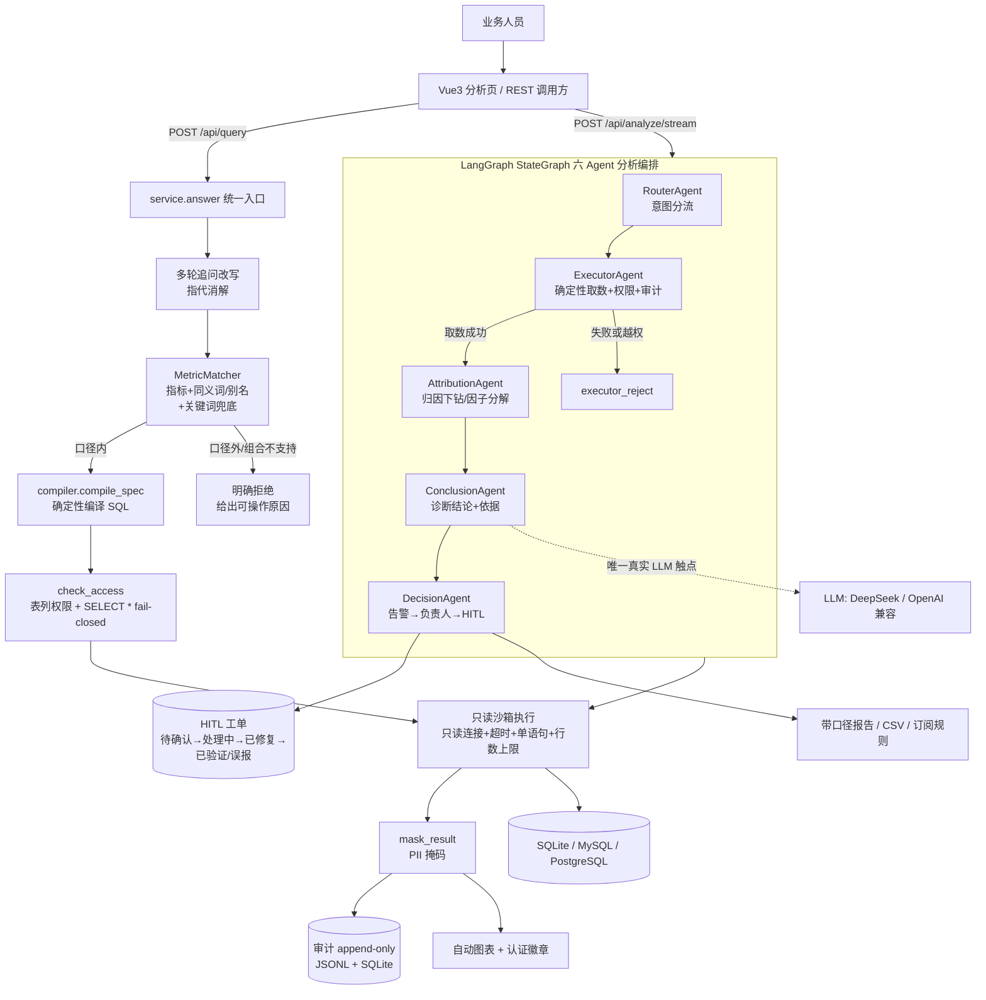

# 多 Agent 协作数据分析系统（语义层优先 · 归因下钻 · 决策闭环）

> 面向**业务人员**的**多智能体协作数据分析系统**：问一句「为什么」，系统像一支分析团队那样分工协作——
> **归因往下钻到底，输出「诊断结论 + 依据 + 建议动作」，并由决策 Agent 决定该不该告警、推给谁、写进 HITL 工单**。
>
> 底座是**配置化的业务语义层**（口径由代码确定性编译、可追溯、零 token），覆盖不到的长尾问题才降级到多 Agent 兜底引擎；
> 两侧接治理面（口径冲突检测、异常归因与逐层下钻、会话级 Agent 记忆、HITL 决策闭环、报告导出）。
> 前端为 **Vue3 + ECharts**，全链路 **SSE 流式**把每个 Agent 的思考逐步推给用户，配炫的归因可视化（驱动瀑布/下钻树/因子占比）。
>
> **主交互**：取数只是入口，**归因逐层下钻（为什么跌 → 拆 → 再拆）+ 决策收口才是主戏**——「取数→归因→诊断→决策→HITL」构成一条完整分析链。

**它解决的不是"教业务写 SQL"**，而是两件真实的事：

1. **同一个指标，不同人算出不同口径** → 指标公式写在配置里、由编译器确定性生成 SQL，并标注负责人/版本；
2. **"这个数为什么涨跌、该不该告警、推给谁"** → 归因逐层下钻定位主因，异常自动带负责人进 HITL 闭环，并可导出带口径的报告。

分三层：

- **语义层（主路径）**：24 个配置化指标 + 4 个维度（dt 支持日/周/月/季）+ 3 个派生指标（比率/占比）。
  命中即由 `compiler.py` **确定性编译** SQL——LLM 不在生成路径上，故可审计、零口径漂移、零 token。
- **LangGraph 六 Agent 分析编排**：命中口径且圈定时间范围的问题，由 **StateGraph** 编排
  RouterAgent→ExecutorAgent→AttributionAgent→ConclusionAgent→DecisionAgent（条件边分流 + 归因下钻/因子分解），
  回答问题"为什么涨跌、要不要告警、推给谁"；口径未命中则明确拒绝并给出可操作原因（不做自由 SQL 生成）。
- **治理与交付**：口径冲突检测、指标口径解释（负责人/版本）、异常归因 + **多轮下钻**、
  HITL 闭环（带负责人与 AI 归因草稿）、**报告/CSV 导出**、订阅告警。

> **实现状态（诚实声明）**：语义层优先已落地（`path=semantic`）并在评测中量化覆盖率；
> `langgraph` 为真实依赖（非回退路径）；Critic 已改为**事后评审**（先执行、再看结果），
> 因实测"事前审写法"会同模型自评退化为风格改写、把对的改错；Chroma 长时记忆 / Checkpoint 未实现。
> 公式防篡改已从"子串包含"升级为**结果列结构绑定**（改系数/诱饵列/注释藏表达式均被拦截）。
> 未实现项不在此虚构为已实现。

> **本轮修复（2026-09，均带回归测试）** —— 详见 `docs/` 与 `tests/test_metric_correctness.py`、
> `tests/test_attribution_additivity.py`、`tests/test_security_hardening.py`：
> 1. **口径数字错了**：评价类指标的 `join_clause` 写死了 `LEFT JOIN order_items`，聚合却在 reviews 上 →
>    无条件 fan-out（真实库实测 `review_count` 114,100 → 真值 99,173；`avg_review` 3.9998 → 4.0709）。
>    现已只保留 1:1 JOIN、按需注入维度 JOIN，并加"编译值 vs 独立手写 SQL 真值"回归测试。
> 2. **比值类指标不再输出"占波动 X%"**：分段 delta 之和对比率/均值天然不等于总变化（AOV 按州可差到 80%），
>    归因层新增**守恒自检**，对不上就降级为分段对照并把原因写进依据。
> 3. **过滤条件也注入 JOIN**：此前 `gmv` 加 `state` 过滤会生成 `WHERE c.customer_state=...` 却没连 customers 表。
> 4. **编译期强制支持度**：`support_dims`/`support_filters` 不再只靠 matcher 把关（`aov+category` 曾被编出未认证结果）。
> 5. **ratio 同源校验加上行级口径**：`where_core` 不同直接拒绝（`ratio@gmv/order_count` 曾把 GMV 悄悄改成"仅已送达"）。
> 6. **指标中心不再毁指标**：`upsert_metric` 此前重建字段 dict 时丢掉 `join_clause`，保存一次 gmv 就永久不可用。
> 7. **日历假象可见**：月度环比给出日均口径与"天数可解释比例"，2 月 vs 3 月这类假波动不再无人提醒。
> 8. **安全加固**：`/api/audit`、`/api/datasources` 加鉴权与脱敏；审计表 append-only 且写失败不再静默；
>    分析链补齐 `check_access` + 审计留痕；`SELECT *` 权限/掩码改为 fail-closed；外部连接器补只读事务与查询级超时；
>    SSE 异常不再假超时；会话记忆按调用者隔离 + TTL/上限。
> 9. **工程一致性**：CI 修绿（原 Streamlit 冒烟步骤引用的 `app.py` 已下线）；`settings.yaml` 清掉死键。
>
> **第二轮（同日，继续把"边界"变成"能力"）**：
> 10. **审计单一权威 sink**：SQLite 是权威、JSONL 仅作镜像，`/api/audit` 只读 SQLite（消除双写分叉），并支持分页。
> 11. **可观测性**：每次取数/分析都记录 `llm_calls / total_tokens / cost / latency_ms`，
>     落入响应、审计表与 `/health`；同时修掉评测里"调用计数恒为 0"（读错字段 `calls`，实际只有 `usage`）。
> 12. **编译器支持派生表 JOIN**：`JOIN (SELECT ...) r` 可被正确识别/去重/合并；`avg_review` 因此改用
>     **订单粒度预聚合**，把 `category` 维度口径**修对后重新认证**（覆盖率仍 84.9%，但没有错的命中）。
> 13. **比率类指标的 rate/mix 量价分解**：`weight_metric` 声明分母 → 价格效应/结构效应/交互项，
>     并**先用权重指标重建总值做自校验**：重建对不上（如跨品类重复计数）就拒绝给分解。
> 14. **统计门控 + 告警质量度量**：告警需同时过"阈值 + 显著性检验（Welch z，零 token）"；
>     真实 Olist 上实测 **56 个阈值告警中 32 个（57%）属噪声被抑制**，决策分三态
>     `alert / watch / normal`（"证据不足"不再伪装成"正常"）。新评测 `evaluation/eval_alert_quality.py`。
> 15. **凭据加固**：口令改 **PBKDF2 随机盐 + 常量时间比较**（旧格式登录时透明升级）；
>     不再预置 `admin/admin123`（改为环境变量引导）；数据源密钥不再硬编码（env 或本机生成文件，仅旧数据解密时回退）。
> 16. **指标口径版本历史 / 血缘 / 回滚**：每次编辑记 before/after/actor（append-only），
>     `rollback_metric` 可撤销某次变更（创建则撤销为删除）；`metric_lineage` 给出表/列级静态血缘；
>     新增 `/api/metrics/history|lineage|rollback`（回滚需 admin）。
> 17. **行级权限（RLS-lite）**：按角色注入行过滤谓词；谓词引用的表不在该指标取数范围时**编译期拒绝**
>     （行级权限只能收紧、不能失效）；分析链与取数链同一套。
> 18. **订阅告警闭环**：`console / file / webhook` 三种投递通道 + `tools/run_subscriptions.py` 调度入口
>     （交给 cron）+ `/api/subscriptions` 增删查与立即检查；投递失败如实上报（cron 退出码非零）。

---

## 核心特性

**一句话概括**：
> 语义层优先的**多 Agent 协作数据分析系统**：**24 个配置化指标 + 派生指标**由编译器确定性生成 SQL（口径可追溯到负责人/版本），
> 带时间范围的波动问题交给 **LangGraph 六 Agent 分析编排**（路由→执行→归因下钻→结论→决策）；
> 在此之上提供**口径冲突检测、异常归因与多轮下钻、会话级 Agent 记忆、权限/掩码/审计、HITL 决策闭环、
> 报告与 CSV 导出、订阅告警**。所有关键结论都有可复核的离线评测（含**注入式真因的归因命中率评测**）。

### 分析主角：六 Agent 协作编排（`src/sqlpa/analysis/orchestrator.py`）

这是档3把产品"主角"升级的关键——不再只是"生成一个数字"，而是**答完"为什么"并决定"怎么办"**：

| Agent | 职责 | 智能成色 |
|---|---|---|
| RouterAgent | 意图分流：取数 vs 波动归因 | LLM + 规则 |
| MetricMatcher | 定位指标/维度/时间范围（口径来自配置） | LLM + 关键词兜底 |
| ExecutorAgent | 编译 SQL → 只读沙箱取数（口径已认证） | 确定性 |
| AttributionAgent | analyze → decide_drill → factorize/drill 归因算术 | 确定性算数 + LLM 决策下一步 |
| ConclusionAgent | 把归因链翻成人话「诊断结论 + 依据 + 建议动作」 | LLM |
| DecisionAgent | 是否告警 → 推负责人 → 写 HITL 工单（带 AI 归因草稿） | 确定性 |

- **会话级 Agent 记忆**：每轮把主因建议写回一份工作记忆；下一轮「那 SP 呢？」这类省略式追问，靠记忆补全口径并沿上轮主因续钻（无需向量库，几个字段的 dict 足够）。
- **SSE 流式**：`/api/analyze/stream` 把 6 个 Agent 的 start/step/done 一个事件一个事件推给前端，逐卡片渲染。
- **归因可视化**：驱动瀑布 / 主因贡献条形 / 因子占比环形 / 下钻树，Vue3 + ECharts 呈现。

- **语义层优先（架构反转）**：命中语义层 → LLM 不在 SQL 生成路径上；口径表达式来自配置，响应带
  `path=semantic`、负责人、版本、数据来源。长尾问题才走 `path=fallback`，并标注未认证。

### 架构红线：生成链路坚决不放 Agent

**"口径 → SQL"这一段永远由配置 + 编译器确定性产生，LLM 不得进入**——这是整个项目的卖点所在，
不是实现偏好：

- **可审计**：审计要能回答"这个数怎么来的"。LLM 生成的 SQL 只能被信任，不能被复核。
- **零口径漂移**：同一问句今天与明天必须编译出**逐字相同**的 SQL，否则"口径一致"是空话。
- **零 token**：主路径一旦花钱，覆盖率与成本就成反比，产品叙事整个倒过来。

一旦破了这条线，坍缩方式很具体：语义层从"认证源"降级为"提示词上下文"，治理面（口径冲突检测、
负责人/版本、未认证标注）随之**失去作用对象**——你无法对一段自由生成的 SQL 说"它违反了哪个口径"。
**治理论证依赖确定性，二者不是并列关系。**

红线边界是**显式且有测试守着**的（`tests/test_semantic_redline.py`，3 项）：

| 区域 | 内容 | 谁说了算 | 实测 |
|---|---|---|---|
| **生成区（红线内）** | `QuerySpec` → SQL | 配置 + 编译器 | 5 个 spec × 5 次编译**逐字相同**；毒化 LLM 走到编译器完全无感 |
| **判断区（允许 LLM）** | 自然语言 → `QuerySpec`（意图识别）、归因拆解、要不要继续下钻、升不升级 | LLM + 关键词/规则兜底 | 主路径唯一 LLM 触点：`_llm_match ← match ← answer`；产物带 `match_method` 可指认 |

> **实测数据（离线，可复现）**：不接 LLM、纯关键词匹配在 66 条业务问题上是 **指标认错 0 条 / 未命中 5 条**，
> 即意图识别这一层的 LLM 调用对这批问法并非必需。因此"意图识别漂移"是当前**唯一**的口径暴露面，
> 且其规模可度量——这也正是下一代改进方向（关键词优先、LLM 只补未命中，从而把暴露面压到 5 条以内）。

- **多 Agent 兜底引擎**：路由 → 写手 → **事后评审**（Critic 只在"执行成功但结果存疑"时介入，避免风格改写）→
  只读沙箱 → 诊断自愈 → 校验；推理与计算解耦，护栏防死循环。
- **治理面**：口径冲突检测（语义相近但公式不同即告警）、口径解释、PII 掩码、表列权限、审计留痕。
- **分析闭环**：异常归因按"维度贡献/乘法因子"拆解，支持**逐层下钻**（追问"那 SP 为什么跌"会自动深挖），
  异常阈值可配、自动带负责人进 HITL。
- **交付物**：带**口径说明**的 Markdown 报告 + CSV（Excel 可直接打开）+ 订阅告警（与归因共用阈值口径）。
- **产品指标**：语义层命中率 / 口径外占比 / 认证率等，见"产品指标"一节（可复跑）。
- **组件评测**：业务语义层命中/治理护栏、归因决策(真Agent)评测、产品指标，以及**归因命中率（注入式真因）**，见"离线评测"各节（均可复跑）。

---

## 功能总览

| 页面/能力 | 说明 |
|---|---|
| 🧪 分析演示（Vue3 + ECharts） | **当前唯一前端页面**：六 Agent 分析链可视化 + 归因/下钻/决策，SSE 流式（`web/`） |
| 💼 业务取数（API） | `POST /api/query`：口径内→配置公式硬约束（🛡️认证）；口径外→明确拒绝并给出可操作原因 |
| 🧭 多 Agent 分析（API） | `POST /api/analyze`、`/api/analyze/stream`、`/api/analyze/report`：六 Agent 编排 + SSE + 报告导出 |
| 📈 指标口径治理（API） | `GET /api/metrics/history`（变更历史）、`GET /api/metrics/lineage`（表/列血缘）、`POST /api/metrics/rollback`（回滚，仅 admin） |
| 🔔 订阅告警（API + CLI） | `GET/POST /api/subscriptions`、`DELETE /api/subscriptions/{id}`、`POST /api/subscriptions/check`；调度走 `tools/run_subscriptions.py`（cron）+ console/file/webhook 投递 |
| ⚙️ 指标中心（库层） | `metric_store` 提供指标/维度/别名的增删改与校验；**尚无对应 API/页面**（接入前请勿在文档里当成已上线功能） |
| 🗄️ 数据源管理（API 只读） | `GET /api/datasources` 列出已注册数据源（密码掩码）；**注册/编辑为脚本或配置操作** |
| 📜 查询历史 / ⭐ 收藏 / 👍 反馈 | 数据表已在 `storage.py`（users/audit/feedback/favorites），**尚未暴露端点与页面** |
| 🔌 REST API | FastAPI：`/api/query` `/api/metrics` `/api/audit` `/api/datasources` `/health`，Swagger 在 `/docs` |

> ⚠️ **与历史版本的差异**：早期 README 曾列出「登录认证 / 查询历史 / 收藏夹 / 指标中心 / 数据源管理」等
> Streamlit 页面。随 `app.py`（Streamlit 前端）下线、前端改为 Vue3 **只保留分析演示页**，
> 上表已按仓库现状重写——文档不再描述不存在的界面。

---

## 目录结构

```
sqlpa/
├── api.py                          # ★ FastAPI REST 后端 + SSE 流式分析端点（/api/analyze/*）
├── web/                            # ★ Vue3 + ECharts 前端（SSE 流式 Agent 面板 + 归因可视化 + 决策卡）
├── start_api.bat                   # ★ 一键启动后端
├── start_web.bat                   # ★ 一键启动前端
├── run_business.py                 # ★ 业务模式 CLI：自然语言取数+口径说明+审计
├── demo_governance.py              #   治理面确定性演示（无需 Key）
├── config/settings.yaml            # 阈值/护栏/模式开关（改规则不改代码）
├── .env.example                    # LLM Key / 端点模板
├── Dockerfile / docker-compose.yml # 一键容器化（api:8000）
├── .github/workflows/ci.yml        # GitHub Actions：push/PR 自动跑离线测试（首次 push 后生效）
├── tools/
│   ├── build_olist_db.py           # Olist 真实数据导入 SQLite（数据窗口 2016-09~2018-10）
│   ├── verify_real_llm.py          # 真实 LLM 联调冒烟（在 Olist 上走完整六 Agent 分析链）
│   ├── run_subscriptions.py        # ★ 订阅告警调度入口（cron 调用：检查 + 投递，失败返回非零）
│   └── download_data.py            # 数据下载辅助（按需）
├── src/sqlpa/
│   ├── analysis/orchestrator.py    # ★★★ 分析主角链：LangGraph StateGraph 六 Agent 编排（归因下钻→诊断→决策）
│   ├── sandbox/sql_executor.py     # 只读加固沙箱（语句级安全校验，全方言一致）
│   ├── sandbox/dialects.py         # MySQL/PostgreSQL 连接器（会话级只读+schema提取）
│   ├── llm/{base,mock_llm,openai_compat}.py  # 可插拔 LLM
│   ├── data/{loader,schema_extractor}.py
│   ├── business/                   # 业务语义层
│   │   ├── business_config.yaml    #   指标/维度/过滤模板/别名（配置化口径）
│   │   ├── metric_config.py        #   加载 + 支持度校验
│   │   ├── metric_matcher.py       #   MetricMatcher：LLM识别+关键词兜底
│   │   ├── metric_guard.py         #   公式硬约束构建 + 篡改校验
│   │   ├── metric_store.py         #   指标中心 CRUD（带校验）
│   │   ├── assembler.py            #   确定性组装器（离线兜底）
│   │   ├── followup.py             #   多轮追问上下文改写
│   │   ├── charting.py             #   结果自动图表推荐
│   │   ├── service.py              #   ★ 统一入口：分级放行（认证/降级）
│   │   ├── datasources.py          #   数据源注册中心（密码加密存储）
│   │   ├── permissions.py          #   表列权限 + PII 掩码
│   │   ├── governance.py           #   口径冲突检测 + 指标口径解释（确定性）
│   │   ├── attribution.py          #   异常归因拆解（乘法因子+维度贡献，并行查询）
│   │   ├── audit.py / hitl.py      #   审计留痕 / 人工复核队列（异常→推送负责人→验证闭环）
│   │   └── storage.py              #   SQLite 持久化（用户/审计/HITL/反馈/收藏）
├── tests/                          # pytest 套件（离线、无需Key、CI可复现）
│   ├── conftest.py                 #   公共 fixture（真实 Olist 切片样本库/迷你库/缺数据自动跳过）
│   ├── test_metric_correctness.py   # ★ 口径真值对照（fan-out、过滤 JOIN、支持度、ratio 同源、编辑不毁指标）
│   ├── test_attribution_additivity.py # ★ 归因可加性降级 + 日历口径 + rate/mix 量价分解
│   ├── test_security_hardening.py   # ★ 审计鉴权/append-only/不静默丢、分析链权限与审计、SELECT * fail-closed、外部连接器护栏
│   ├── test_significance_gate.py    # ★ 统计门控（Welch z）+ 决策三态 alert/watch/normal
│   ├── test_observability.py        # ★ LLM 用量/成本/时延计量 + 审计单 sink
│   ├── test_credentials.py          # ★ PBKDF2 随机盐、无预置弱口令、数据源密钥不入源码
│   ├── test_metric_versions.py      # ★ 口径版本历史/回滚/血缘
│   ├── test_row_level_security.py   # ★ 行级权限（注入 + 失效即拒绝）
│   ├── test_subscriptions.py        # ★ 订阅告警：规则/门控/投递/API 权限
│   ├── test_analysis_orchestrator.py # ★ 分析主角链 / SSE / 会话记忆测试
│   ├── test_sandbox.py             #   沙箱安全 + 方言适配
│   ├── test_product.py             #   分级放行/多轮/图表/指标CRUD/数据源
│   ├── test_api.py                 #   REST API 接口
│   ├── test_attribution_drill.py   #   归因下钻 / 因子分解
│   ├── test_attribution_decisions.py # 归因决策(真Agent)评测回归
│   └── test_semantic_compiler.py   #   语义层编译器契约（编译确定性、全部可执行）
├── evaluation/                     # 可复核的离线评测（确定性、无需 Key）
│   ├── eval_business.py            #   语义层命中/口径外拒绝/权限/掩码/审计
│   ├── eval_decisions.py           #   归因决策(真Agent) 26 场景 + 6 BORDERLINE 判断题
│   ├── eval_product.py             #   产品指标（命中率/降级率/认证率）
│   ├── eval_alert_quality.py       # ★ 告警质量：阈值告警 vs 阈值+显著性门控（假阳性治理）
│   └── eval_attribution.py         # ★ 归因命中率（注入式真因，Ground Truth by Construction）
├── docs/                           # CaseStudy 与 项目过程问题与解决
└── data/                           # olist(真实公开数据，gitignored) / reports / audit
```

## 系统架构



> 关键设计：**推理交给 LLM（意图识别、归因讲解），执行/比对/护栏/口径公式交给确定性代码**——
> 杜绝大模型算错或篡改业务口径。生成链路（QuerySpec → SQL）**零 LLM**；
> 六 Agent 里只有 `ConclusionAgent` 与归因动作决策真的调 LLM，其余是确定性函数（README 不把它包装成六个智能体）。
> 取数链与分析链走**同一套**权限、掩码、审计与编译口径——不存在"分析入口绕过治理"的第二条路。

---

## 快速开始

### 方式一：一键启动（推荐）

```bat
start_api.bat    # 后端 http://localhost:8000/docs （需先有 venv）
start_web.bat    # 前端 http://localhost:5173
```
或手动：`.venv\Scripts\python.exe -m uvicorn api:app --port 8000` + 在 `web/` 下 `npm run dev`。
前端在 **5173** 打开后，输入「本月 GMV 为什么跌？」即可看到六 Agent 流式执行 + 归因可视化 + 决策闭环。

### 方式二：本地

```bash
pip install -r requirements.txt
cp .env.example .env       # 填 LLM_API_KEY（DeepSeek/OpenAI兼容）；不填则离线模式

# 离线测试（无需 Key、无需外部数据）
pytest tests -q

# 前端（Vue3 + ECharts）
cd web && npm install && npm run dev   # http://localhost:5173

# FastAPI 后端
uvicorn api:app --port 8000

# 真实 LLM 联调冒烟（真实 Olist 上走完整六 Agent 分析链；无 Key 可加 --dry）
py tools/verify_real_llm.py

# 归因命中率评测（注入式真因，Ground Truth by Construction）
py evaluation/eval_attribution.py
```

### REST API 示例

```bash
curl -X POST http://localhost:8000/api/query \
  -H "Content-Type: application/json" \
  -d '{"question": "各个品类的GMV", "role": "analyst"}'
```

返回含 `mode`(metric/free)、`certified`(是否口径认证)、`sql`、`columns`、`rows`、`agent_trace`（多Agent编排链路）。

---

## ~~兜底组件评测（Spider-dev · 多 Agent 引擎）~~

> ⚠️ **本节所述的自由 SQL 生成引擎（`run_eval.py` / `src/sqlpa/graph` / `agents` / `eval`）已随"语义层优先"策略移除**：
> 口径内走确定性编译、口径外明确拒绝，不做未认证的自由 SQL 生成。以下为组件下线前其自身评测的**遗留记录**，
> 不代表当前产品行为，仅保留作历史对照，勿引用为新指标。产品归因质量请以 `evaluation/eval_attribution.py`（注入式真因命中率）为准。
> 复现命令（需 LLM Key + 联网下载 Spider 数据）：`python run_eval.py --dataset spider --split dev --sample 50 --seed 42 --engine langgraph --baseline --ablation --ablation-rounds 1,3 --out-dir ./eval_results`

## 业务产品模式（把实验变成真实业务产品）

> 为避免"只是一个基准验证实验"，在业务语义层之上叠加了一层**产品层**。当前仓库只有一种运行模式：

- 💼 **业务产品模式**（`api.py` / `run_business.py` / `web/`）：开启业务语义层 + 护栏 + 审计，面向**业务人员自然语言取数**。
- （历史）🧪 **Spider 评测模式**（`run_eval.py`）**已随兜底引擎下线移除**，其数字仅作历史对照，勿引用。

### ⚠️ 价值锚点：**这不是"教业务写 SQL"**
这个项目**不是**"把中文翻译成 SQL、帮不会写 SQL 的人写 SQL"（那是 NL-to-SQL 最容易被问倒的伪定位）。真正的价值是 **指标语义层 + 治理 + 长尾自助取数**：

- **核心**：把 GMV / 客单价 / 取消率等**业务口径配置化统一**（公式写在配置、由编译器确定性生成，并做**结果列结构绑定校验**），+ **权限白名单 / PII 掩码 / append-only 审计 / 口径治理 / 异常归因闭环**，让业务不用排队找数分也能拿到**口径一致**的数据。**安全底座（权限+掩码+只读沙箱+审计）已核验：表列权限粒度（含 `SELECT *` fail-closed）、PII 覆盖列、沙箱只读与多语句拦截、审计留痕与不可删改均已由离线测试锁定。**
- **服务的是"长尾 / 临时 / 探索式"取数**：看板报表覆盖**固定、高频**的指标；而"**临时想看某个维度异常、某组合**"这类**长尾**问题看板覆盖不到、找数分又排队长——**这才**是它的用武之地（**不是替代看板**，是补充看板覆盖不到的长尾，且因语义层而口径/权限可控）。
- 解决的问题：**"同一个指标，不同人、不同 SQL 算出不同口径"** 的真实痛点。
- **治理面增量**（新增，区别于纯 Text-to-SQL）：**规则 + LLM 协同**，各自解决明确的问题——
  - **规则（确定性算术 / 白名单 / 状态机）**负责"**可复核、零漂移**"：公式校验、权限放行、HITL 闭环状态机、归因的维度拆解与阈值判定——这些一旦交给 LLM 就不可复核，所以用代码锁死；
  - **LLM 负责"**业务听得懂**"的语义增强**：意图识别、**归因总结**（把波动与主因翻成人话）、口径冲突的自然语言解释——这些没有唯一正确答案，交给 LLM 更有价值；
  - **解决了什么**："同一个指标，不同人、不同 SQL 算出不同口径"（规则锁口径）+ "这个波动从哪来、该不该告警、推给谁"（规则定位 + LLM 讲解），两者协同才构成可复盘的治理闭环。
  - **口径治理**：GovernanceAgent 自动检测"语义相近但公式不同"的指标冲突，并给出**可追溯的口径解释**（负责人/版本/公式），避免口径分歧无人发现。
  - **异常归因**：归因 Agent 按**乘法因子（精确、含交互项）+ 维度贡献度**拆解波动——是订单量跌了、客单价跌了，还是某区域/品类跌了；阈值**可配置**。查询按当期/上期**并行**执行降延迟。比率/均值类指标不做"占波动"表述（分段 delta 之和在该类指标上不成立，见守恒自检）。
  - **闭环（ClosureAgent MVP）**：异常自动写入 HITL 队列并**关联指标负责人**，状态机为 **待确认 → 处理中 → 已修复 → 已验证 / 误报**；处理状态可追踪，验证需重跑指标。
- **对标品类**：这是一类真实存在的产品 —— **dbt Semantic Layer / Cube / MetricFlow / Looker / AtScale**（"语义层 + 自助 + 治理"），以及近两年的 **AI-BI / text-to-dashboard 智能体**。**NL 生成 SQL 只是外壳，语义层 + 治理才是核心。**

### 分级放行（产品化的核心策略）

- **口径内**（命中配置指标且组合受支持）→ 权威公式作为**硬约束**喂给 Writer → 引擎生成查询结构 → 校验"公式未被篡改" → 权限 → 只读执行/掩码 → 审计。结果标记 **🛡️ 口径已认证**。
- **口径外**（未命中指标 / 维度组合不受支持）→ 不再生硬拦截，走引擎多 Agent **自由生成**，权限/沙箱/掩码照常生效，结果标记 **🔓 未经口径认证**，由用户自行判断。

### 安全底座状态机（PermissionAgent）

权限不是"开关"而是一条确定性的**状态机**，不依赖 LLM，可复核：

```
请求 → 校验(角色表列白名单 + 敏感列判定) → 放行 / 拦截 → 审计留痕
        └─ 拦截（含照常执行、仅掩码两态）→ 越权/敏感 → 入 HITL 转人工核验
```

- **放行两态**对同一请求分别判定：**表列越权**（限定列 / **非限定列** / **`AS` 别名改写** 均拦截，已核验 5/5）与 **PII 敏感列**（命中则掩码而非拦截，含别名改写，已核验 2/2）→ 前者入 HITL 让分析师修正，后者静默脱敏照常返回。
- 与 **同义词/别名**协同：MetricMatcher 靠同义词把"销售额/成交额/GMV"归一，才能正确触发权限白名单；没有别名归一，同一意思会被算成不同指标、绕开口径控制。
- 与 **闭环状态机**衔接：任何被权限 / 公式 / 引擎失败拦下或归因异常判定的边界情况，都汇入 HITL 队列（**待确认 → 处理中 → 已修复 → 已验证 / 误报**）并关联负责人，人工处理后才关闭。

### 多轮追问 + 自动图表

- **多轮追问**：有 LLM 时做指代消解/省略补全（question rewriting），无 LLM 时确定性启发式兜底；改写结果透传下游并记入审计。
- **自动图表**：按「列名 + 数据类型 + 行数」确定性推荐——1维度+1数值→柱状图（日期维度→折线）、2维度→分组柱状、单行单数值→指标卡。

### 指标中心（语义层可运营）

指标的公式、来源、支持维度全部配置化。指标中心页面提供可视化增删改（带校验），保存即时生效于业务取数。**防篡改校验是"表达式子串包含"判定**：能拦住"把表达式删掉"，但拦不住"保留表达式同时改过滤条件 / 对表达式做包装"——这是已知局限，不是完备的口径保障。

指标定义字段（最小闭环）：**指标名、同义词/别名、公式、口径说明、负责人、版本号、状态**。其中**同义词/别名**是 MetricMatcher 语义匹配与 GovernanceAgent 冲突检测的输入——没有别名，用户的"销售额 / 成交额 / GMV"会被当成不同指标或无法命中；版本号与负责人用于口径解释可追溯。

### 数据源接入（MySQL / PostgreSQL）

- 沙箱的**语句级安全校验**（SELECT-only / 高危关键字拦截）对所有方言一致生效；
- 外部连接器另有**会话级只读双保险**（MySQL `SET TRANSACTION READ ONLY` / PostgreSQL `set_session(readonly)`）；
- schema 通过 information_schema 自动提取（含外键），注入 LLM 上下文时附带方言提示。
- 驱动惰性导入：仅用 SQLite 可不装 pymysql/psycopg2。

**业务数据底座：Olist 真实公开电商数据集（~10万订单）**
```bash
# 你下载 Olist CSV 放到 data/olist/ 后：
python tools/build_olist_db.py --src data/olist --out data/olist/olist.db
```
> 说明：业务层用**真实公开数据 Olist**（2016-09~2018-10 窗口，约 9.9 万订单）。演示/评测提问请落在该窗口内，
> 如"2018-06 GMV 为什么比上月跌"；不要再问"本月/最近30天"——相对今天的日期在窗口外必然无数据。

### 验收指标（衡量产品价值，而非 SQL 准确率）

| 指标 | 含义 |
|---|---|
| 口径争议下降率 | 引入指标中心后，同一指标口径不一致的反馈环比 |
| 取数等待时间 | 从提问到拿到认证结果的时间（口径内应秒级） |
| 异常发现→归因时间 | 从波动出现到归因定位根因维度的时间 |
| 闭环率 | 写入 HITL 的异常中被处理并验证关闭的比例 |
| 脱敏覆盖率 | 敏感列在所有访问路径（含别名改写）下都被掩码的比例 |

### 演示场景（用 Olist 演练治理面，而非演示 SQL 翻译）

1. **口径冲突**：故意配置两个语义相近但公式不同的指标（如"成交额"含运费 vs"GMV"不含），在口径治理页展示 GovernanceAgent 自动告警。
2. **异常下跌**：选 Olist 中订单量有波动的时段，演示归因 Agent 并行拆解"是订单量/客单价还是某品类/区域下跌"，并提示已推送负责人。
3. **敏感访问**：用 analyst 角色查询含 `customer_zip_code_prefix` 等敏感列，展示 PII 掩码与权限拦截（含别名改写场景）。

> **真实实测结果（`demo_governance.py`，Olist 全量库，可复现）**：
> - **口径冲突检测**：当前指标中心健康无冲突；临时注入近义指标「净成交额」(`SUM(oi.price)-COALESCE(SUM(r.refund),0)`) 后立即被 GovernanceAgent 告警，指认同 GMV 公式不一致，并带出负责人/版本；指标解释 GMV 返回公式 `SUM(oi.price)`、负责人「财务线」、版本 `v3`。
> - **异常归因（2018-03 vs 2018-02）**：GMV 当期 98.1 万 vs 上期 83.8 万，环比 **+17.1%**（超默认阈值）；并行拆解出主要贡献维度 —— **SP 州 +7.4 万（占波动 52%）**、**品类「手表/礼品 relogios_presentes」+3.5 万（占 24%）**；订单数 +6.8%，同样归因到 SP 州 +339 单（占 76%）。
> - **闭环**：异常自动写入 HITL 队列并关联负责人「财务线」，记录含各维度贡献占比，供后续"待确认→处理中→已修复→已验证/误报"状态流转。
>
> 复现：`PYTHONPATH=src python demo_governance.py`（无 LLM 依赖，纯确定性计算）。

### 不做清单（诚实边界，避免过度承诺）

- ❌ 不做通用 BI 替代（不抢 Tableau/看板的固定看报表位）
- ❌ 不做无治理的自由 SQL（口径外结果标记"未认证"，由用户自行判断）
- ❌ 不做全自动治理（口径冲突检测是确定性规则，归因是确定性算术，不自动改公式/自动修数据）
- ❌ **不把权限/PII 掩码后置**：安全底座是上线底线，外部未脱敏数据不给业务用
- ❌ 不做字段级血缘（当前只做"维度拆解"轻量归因，不追踪表/字段级血缘）

## 产品指标（北极星：语义层命中率）

> 这一节回答"**这个产品到底覆盖了多少业务问题**"，而不是"SQL 写得对不对"。
> 跑法：`python evaluation/eval_product.py`，逐题明细落 `evaluation/reports/product.json`。
> 题集：`evaluation/business_questions.jsonl`——**66 条人工标注的真实感业务问题**。

| 指标 | 结果 | 含义 |
|---|---|---|
| ★ **语义层命中率** | **84.9% (56/66)** | 业务问题落到**已治理口径**的比例（主路径覆盖率，决定"口径一致"能覆盖多大面） |
| 口径内执行成功率 | **100%** | 命中的问题都真的跑出了结果 |
| 指标识别准确率 | **100%** | 识别出的指标与人工标注一致 |
| 维度识别准确率 | **100%** | 识别出的分组维度与标注一致 |
| 拒绝判定准确率 | **100%** | 指标支持但维度组合不合法时，**明确拒绝**而非硬生成 |
| 口径认证率（成功中） | **100%** | 返回成功的结果全部带"口径已认证" |
| 口径外占比 | **7.6% (5/66)** | 语义层没有对应指标 → 线上走多 Agent 降级 |

**这些数字说明什么**：语义层已能覆盖大部分典型问法（指标 6→24、维度 +订单状态、时间粒度 4 档、派生指标 3 个），
剩下的 7.6% 是**语义层确实没有的指标**（如复购周期、库存周转）——它们是降级路径的用武之地，而不是缺陷掩盖。

> ✅ **「各品类的评分」这个组合是"修对了才留下的"**：它一度返回**被条目数加权的错误均值**
> （reviews × order_items 是 1:多）。现在 `avg_review` 改用**订单粒度预聚合派生表**，
> 品维度下同一评价值重复多少次都不改变 AVG，口径由 `desc` 写明。
> 覆盖率因此仍是 84.9%，但这个数字里没有"错的命中"。

> ⚠️ **口径说明**：本评测**离线运行**（`llm=None`），因此**降级路径未被实际触发**——离线时口径外问题会被
> 明确拒绝而不是交给多 Agent。故这里以"语义层命中率"为主指标，口径外占比仅作降级规模的上界。
> 报告 `offline_note` 字段中同样记录了这一点。

### 多 Agent 决策质量（"下一步该往哪拆"值多少分）

> 这一节回答"**多 Agent 到底做了哪些判断、这些判断值多少准确率**"，而不是"能不能生成 SQL"。
> 跑法：`python -m evaluation.eval_decisions`（离线，零 token）；接真实模型加 `--llm`。
> 题集：`evaluation/eval_decisions.py` 内的 **32 条专家自标追问用例** = 26 正例（4 种动作均衡：drill 6 / switch_dim 6 / factorize 7 / none 7）+ **6 条判断题**（规则判不出、只等 LLM 真判断，衡量增值）。

| 指标 | 结果 | 含义 |
|---|---|---|
| **规则命中率** `rule_accuracy`（纯规则+门控，零 token） | **81.2% (26/32)** | 26 条正例由规则+门控确定性全中；6 条判断题规则判不出，离线只能蒙/漏 |
| **LLM 增值** `llm_value`（接 LLM 命中率 − 规则命中率） | **+0.0%**（qwen3.8-27b） | 32 条接 LLM 仍 26 条；**判断题从规则 0/6 → LLM 5/6 (83.3%)**，但整体被"真追问"的稳定性成本抵消——见下方诚实口径 |
| **执行正确率**（做完算对） | **100% (4/4)** | 因子分摊守恒（`-70.000` vs `-70.000`）、份额合计 `0.9999`、主因方向正确、下钻分支内主因隔离 |
| 门控的价值 | **19/26 → 26/26**（仅正例） | 关掉策略门控还原旧规则即 19/26（7 条量价问法全漏），差值可被测试复现 |

**这套数字回答一类具体质疑**："决策层是不是还不如写死的规则？" 26 正例上，**旧**决策层（把 factorize 决定权整体交给 LLM）只有 19/26，
与规则打平——根因是 prompt 里一句指令级偏置（"若指标是 gmv…优先考虑 factorize"），导致 LLM 把"本月全国GMV是多少"也判成因子分解（过度应用 7 条）。
现在改成**代码管策略、LLM 管判断**：

1. **策略门控**（确定性，0 token）：`is_factor_question` 判定"这一问是不是在问量价"。只有放行才允许 `factorize`，放行后直接由规则给出。
2. **规则地板**（确定性，0 token）：没有追问语气 = 用户只是在看数/做对比 → 直接 `none`，不交给 LLM（实测 LLM 会"顺手多拆一层"）。
3. **LLM 判断**（花 token）：真实追问里"往哪儿拆、要不要换讲法"才交给 LLM；LLM 越界仍会回退规则并记 `gated_from`。

> ⚠️ **诚实口径（别把这些数字当成泛化准确率的证据）**：
> - **32 条真值由实现者自标**（依据模块内的判定规则），不是独立第三方标注，故只承担**回归测试**与**方法论演示**两个身份；系统级准确率只由公共基准 Spider-dev 支撑（其 gold 由数据源外部定义）。若引入独立标注第二人可回填一致性后再谈泛化。
> - 题集规模小，**任何命中率都不等于泛化**；门控判据本身是在观察这批问法后定的，存在过拟合风险（用"额外两条规则判不出、LLM 判得出"的用例做了反向校验，见 `tests/test_attribution_decisions.py`）。
> - 已实跑 `eval_decisions.py --llm`（qwen3.8-27b）：LLM 仅在 6 条判断题真调；整体 `decision_accuracy` 仍 26/32=81.2%，`llm_value=+0.0%`——判断题从规则 0/6 升到 5/6 (83.3%)，但几十条"真追问"题上 LLM 判偏了几题，净增被抵消。**结论是"LLM 判断力强但稳定性有成本"，不是"LLM 没用"。**
> - 评测喂给决策层的是**原始问句**，而 service 层实际喂的是改写后的问句，两者尚未对齐（已知口径差）。

---

## 业务语义层评测（离线、确定性、无需 API Key）

> 这一节回答的是"**语义层 + 治理**到底管不管用"——即本项目自称的核心，而不是 SQL 生成准确率。
> 跑法：`python evaluation/eval_business.py`，逐例明细落在 `evaluation/reports/business.json`。

| 指标 | 结果 | 说明 |
|---|---|---|
| 口径内命中率 | **100% (8/8)** | 配置内的"指标+维度"组合是否被正确识别（`llm=None`，纯确定性关键词链路） |
| 指标识别准确率 | **100% (8/8)** | 命中时 `metric_key` 与标注一致 |
| 维度识别准确率 | **100% (8/8)** | 识别出的维度集合与标注一致 |
| 口径内执行成功率 | **100% (8/8)** | 口径内问题经确定性组装器真的跑出结果（Olist 同结构样本库） |
| 口径外拦截率 | **100% (4/4)** | 无对应指标 / 维度组合不受支持时**拒绝**而非硬生成 |
| 拒绝原因可读率 | **100% (4/4)** | 拒绝时给出可操作提示（业务人员能据此调整问法） |
| **公式防篡改拦截率** | **100% (5/5)** | 校验已升级为**结果列结构绑定**：改系数 / 诱饵列 / 注释藏表达式 全部拦截 |
| 权限拦截率 | **100% (5/5)** | 限定列 / **非限定列** / **别名改写** 三种越权写法全部拦下；允许列与 admin 不误拦 |
| PII 掩码覆盖率 | **100% (2/2)** | 含 `AS 别名` 改写场景（历史绕过点） |
| 审计覆盖率 | **100% (12/12)** | 每次取数都写入审计留痕（分析链同样留痕，见安全加固） |

> **口径说明（请连同数字一起引用）**：
> - 这是**离线确定性验证**（`llm=None` + Olist 同结构小样本库），不是 LLM 准确率；样本为人工设计的用例，规模小，**不代表真实流量的分布**。
> - **公式防篡改 100% 是"结构绑定"带来的**：此前实现是"表达式子串包含"，把表达式留在注释、字符串或诱饵列里都能绕过（实测 4 例中 3 例放行）。
>   现在要求"别名 = 指标 key 的结果列"与配置表达式逐字等价，并新增了 5 条反例测试（`tests/test_business_eval.py`）。
>   仍非完备：它校验的是**词法等价**，不解析 SQL 语义（若将来恢复自由 SQL 生成，应改成 AST 级校验）。
> - 配置里 `sensitive_columns` 还列了 `customer_phone`，但 Olist 的 `customers` 表**没有 phone 列**，该条目在当前数据下不可达；权限/掩码用例因此改用真实存在的 `customer_zip_code_prefix`。

## 测试与 CI

```bash
pytest tests -q    # 267 项离线测试（267 passed，0 xfail）：沙箱安全/查询超时/配置化/方言适配/多Agent编排/分级放行/多轮/图表/指标CRUD/数据源/REST API/权限与掩码/行级权限/业务语义层/治理闭环/语义层编译器/语义层红线契约(编译确定性与生成区零LLM)/口径真值对照/归因可加性与日历口径/量价分解/统计门控/审计与可观测性/凭据加固/指标版本历史/订阅告警/归因下钻/归因决策/因子分解/交付物
```
> **测试数口径**：267 = 历史 176 项 + 两轮新增 91 项回归（口径真值对照 `test_metric_correctness.py`、
> 归因可加性与日历 `test_attribution_additivity.py`、量价分解与显著性门控 `test_significance_gate.py`、
> 安全加固 `test_security_hardening.py`、可观测性 `test_observability.py`、凭据 `test_credentials.py`、
> 指标版本 `test_metric_versions.py`、行级权限 `test_row_level_security.py`、订阅告警 `test_subscriptions.py`）。
> 此前唯一的 xfail（公式子串校验可绕过）已随结构绑定修复转为**通过**，因此不再有 xfail。
> 依赖真实 Olist 库的用例在缺数据时**跳过**（`real_olist_db` / `sample_db` fixture），
> 因此公开 CI 上不会把"环境缺数据"误报成"代码回归"。

- **数据**：依赖真实 Olist `data/olist/olist.db`；测试每次从其中抽一小撮真实切片建临时库（非捏造日期），本地与 CI 行为一致。
  纯逻辑用例（编译器口径真值、指标编辑、安全护栏）使用**自建小库**，不依赖真实数据。
- **GitHub Actions**：每次 push/PR 自动跑离线套件 + 两个离线评测（缺真实库时评测**大声跳过**而非失败），
  并做入口脚本语法自检（`.github/workflows/ci.yml`）。

## 诚实说明（局限与边界）

- **当前唯一的 LLM 触点**是"意图识别"（自然语言 → QuerySpec）与"结论/归因讲解"。
  RouterAgent 与 MetricMatcher 是**同一次语义匹配的两次上报**，Executor/Decision 是确定性函数——
  所谓"六 Agent"是**编排**上的六个阶段，不是六个独立智能体，README 不把它当作"多智能体更强"的证据。
- **归因做了守恒自检，但没有统计显著性检验**：单期环比仍是主要形态（已补日历口径提示：日均波动 + 天数可解释比例），
  阈值 5% 是经验值，未在真实波动分布上标定，因此**假阳性率未被度量**——这是下一步最该补的评测。
- **比率/均值类指标不做"占波动 X%"**：分段 delta 之和在该类指标上数学不成立（AOV 按州可差到 80%），
  系统会自动降级为分段对照并说明原因。要给出真正的贡献度需要 rate/mix 分解（未实现）。
- **评价类指标的口径已显式化**：Olist 的 `reviews` 表有 802 个重复 `review_id`（100,000 行 / 99,173 个唯一），
  因此"评价数/好评率"采用**去重口径**（`COUNT(DISTINCT review_id)`）并在配置 `desc` 里写明；
  `avg_review` 不支持 `category` 维度（1:多 JOIN 下 AVG 无法去重，需编译器支持子查询聚合）。
- **数据层**：依赖真实 Olist `data/olist/olist.db`；`data/` 下产物（审计 JSONL、HITL、报告、订阅）均为运行期生成、不进版本库。
- **长时记忆 / Checkpoint 未实现**。`config/settings.yaml` 中未被代码读取的历史键已删除
  （`pipeline.max_repair_round`、`route_llm_fallback`、`eval.dataset` 等），
  `security.allow_multi_statement` 也已移除——实测该开关无意义（SQLite `execute` 与 pymysql 默认都不支持多语句）。
- **外部库（MySQL/PostgreSQL）**：已实现语句级安全校验、会话级只读（MySQL 显式关闭 autocommit + 只读事务；
  PG 连接参数 `default_transaction_read_only=on`）与查询级超时（`MAX_EXECUTION_TIME` / `statement_timeout`），
  并有单测锁住语句序列；但**真实库连通性仍需在装有驱动与目标库的环境验证**。
  另外行数上限是客户端 `fetchmany` 截断（服务端仍会扫完），所以超时护栏不可省。
- **审计**：SQLite 为**权威 sink**（append-only 触发器，禁止 DELETE/UPDATE），JSONL 仅作兼容镜像；
  `/api/audit` 只读 SQLite 并支持分页。权威写入失败会记日志与计数（`audit_write_failures()`，`/health` 可见）；
  镜像失败只影响镜像（`audit_mirror_failures()`），不再出现"两个 sink 各说各话"。
- **前端未纳入本仓库的 CI**：`web/`（Vue3 + ECharts）当前只有分析演示页，
  无 lint/构建流水线；登录、查询历史、收藏、反馈等能力只有数据表与库函数，尚未暴露端点。
- **数据源密码**使用 XOR+Base64 **可逆编码**（密钥为源码内硬编码的兜底值，非加密）存储于 `data/datasources.yaml`（已 gitignore），仅原型级；生产部署应改用密钥管理服务（KMS）。
- **用户密码**使用 SHA-256 哈希存储于本地 SQLite（`data/app.db`，已 gitignore），但**盐值是全局硬编码常量**且比较非常量时间，仅原型级；`ensure_default_users` 还会预置 `admin/admin123`，**上线前必须删除或强制改密**。
- **API 鉴权**：`/api/query`、`/api/analyze*`、`/api/audit`、`/api/datasources` 的角色**只认凭据、不认请求体**。
  配置 `SQLPA_API_TOKENS="tokenA:admin,tokenB:analyst"` 后必须带 `X-API-Token`；
  未配置时（本地/演示）按最小权限角色 `SQLPA_DEFAULT_ROLE`（默认 analyst）执行，`/api/audit` 对非 admin 脱敏。
  **生产部署务必配置 token 或接入企业鉴权**。
- **行级权限是应用层实现（RLS-lite）**：谓词注入编译后的 WHERE，可见、可测、与口径一起进审计；
  但它**不是数据库原生 RLS** —— 绕过应用直连数据库即失效。生产应叠加数据库视图/RLS 策略或独立只读账号。
- **指标血缘是表/列级静态解析**（来自 `from_clause`/`join_clause`/表达式），不是数据库字段级血缘，
  也不含上游加工链路与字段级影响分析。
- **统计门控是近似检验**：Welch z 检验假设日间独立、近似正态，对强趋势/强周期数据偏保守；
  它只用来**抑制**告警（减少假阳性），不用来"证明"波动存在。假阳性率本身仍未被精确度量
  （`evaluation/eval_alert_quality.py` 报的是告警量下降与成因结构，真 FP/FN 需独立标注集）。
- **订阅告警无邮件/SMS 通道**：需要 SMTP/短信服务凭据与配额，属部署侧配置；仓库内提供的是
  `console / file / webhook` 三种通道 + cron 调度入口（`tools/run_subscriptions.py`），**内置调度器刻意不做**。
- **归因决策层有 32 条专家自标用例**（`evaluation/eval_decisions.py`）：26 条正例 + 6 条 BORDERLINE 判断题。
  **真值由实现者自标、非独立第三方**；离线（`llm=None`）命中 26/32=81.2%，`llm_value=+0.0%`（判断题 0/6 → 5/6），
  门控判据存在过拟合风险，**不要把它当普适准确率**。

## 指标口径

- **EX (Execution Accuracy)**：执行结果与金标准一致即判对，忽略写法差异（最贴合业务价值）。**金标准自身执行失败的题不计为正确**，并在汇总中单独报告 `gold_failed` 数量。
- **EM (Exact Match)**：与金标准 SQL 逐字匹配（较严，参考用）。
- **平均修复轮次 / 端到端延迟 / Token 消耗 / 估算成本**：工程性能指标，随逐题产物一起输出。
